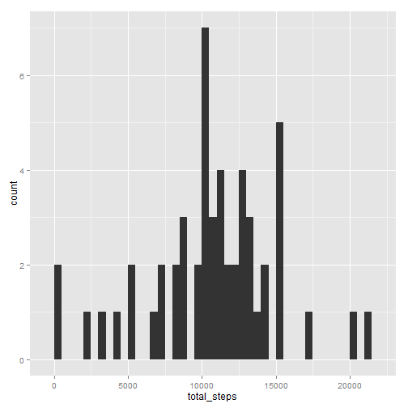
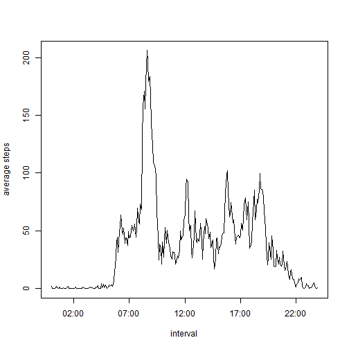
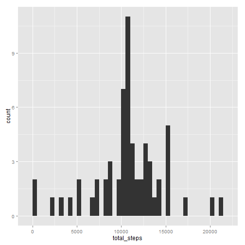
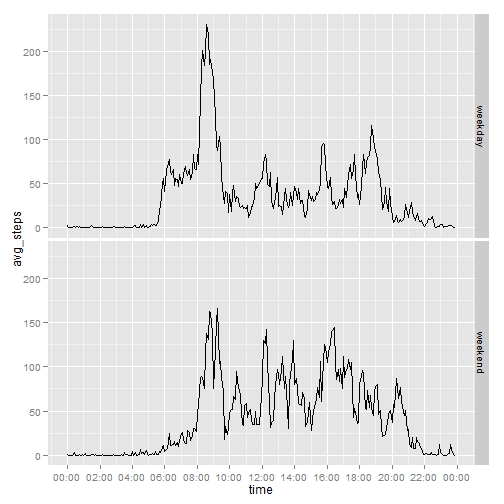

## Loading and preprocessing the data

Loading the data into activity:  

```r
fileName <- "./data/activity.csv"
activity <- read.csv(fileName)
summary(activity)
```

```
##      steps                date          interval     
##  Min.   :  0.00   2012-10-01:  288   Min.   :   0.0  
##  1st Qu.:  0.00   2012-10-02:  288   1st Qu.: 588.8  
##  Median :  0.00   2012-10-03:  288   Median :1177.5  
##  Mean   : 37.38   2012-10-04:  288   Mean   :1177.5  
##  3rd Qu.: 12.00   2012-10-05:  288   3rd Qu.:1766.2  
##  Max.   :806.00   2012-10-06:  288   Max.   :2355.0  
##  NA's   :2304     (Other)   :15840
```

Add an additional column "time" which combines date and interval:  

```r
activity$time <-
    strptime(paste(activity$date, 
                    paste(activity$interval %/% 100, ":",
                    activity$interval %% 100, sep="")), 
         format="%Y-%m-%d %H:%M")
```

## What is mean total number of steps taken per day?

For this section, NA's are ignored.  

Calculate total number of steps each day and plot histogram:  

```r
# put complete cases into activity_complete
activity_complete <- activity[which(complete.cases(activity$steps)), ]
# total number of steps
sum_steps <- aggregate(x = activity_complete$steps, by = list(activity_complete$date), FUN = "sum")
names(sum_steps) <- c("date", "total_steps")
# plot histogram
library(ggplot2)
qplot(total_steps, data=sum_steps, geom="histogram", binwidth= 500)
```

 

Calculate and report the mean and median total number of steps taken per day:  

```r
# mean of daily total steps
mean(sum_steps$total_steps)
```

```
## [1] 10766.19
```

```r
# median of daily total steps
median(sum_steps$total_steps)
```

```
## [1] 10765
```

## What is the average daily activity pattern?

For this section, NA's are ignored.  

Average number of steps taken, by interval:  

```r
# calculate average number of steps taken each day
steps_intv <- aggregate(x = activity_complete$steps, by = list(activity_complete$interval), FUN = "mean")
names(steps_intv) <- c("interval", "avg_steps")
# construct x axis in %H:%M:%S format for plotting
steps_intv$interval <- strptime(paste("2012-10-01", # a pseudo date
                    paste(steps_intv$interval %/% 100, ":",
                    steps_intv$interval %% 100, sep="")),
             format="%Y-%m-%d %H:%M")
plot(y=steps_intv$avg_steps, x=steps_intv$interval, type="l", xlab="interval", ylab="average steps")
```

 

The 5-minutes interval which has maximum steps occurs at 08:35 as shown below:  

```r
max_steps <- max(steps_intv$avg_steps)
max_intv <- steps_intv[which(steps_intv$avg_steps == max_steps), 1]
hours(max_intv)
```

```
## [1] 8
```

```r
minutes(max_intv)
```

```
## [1] 35
```

## Imputing missing values

Total number of missing values in the dataset:  

```r
sum(is.na(activity$steps))
```

```
## [1] 2304
```

Fill in missing values, using mean of the 5-minute interval:  

```r
# calculate mean of 5-minute interval, using complete cases
steps_intv <- aggregate(x = activity_complete$steps, by = list(activity_complete$interval), FUN = "mean")
names(steps_intv) <- c("interval", "avg_steps")
# Fill in missing values, into new dataset activity_fill
activity_fill <- activity
nrow_na <- which(is.na(activity_fill$steps))
for (i in seq_along(nrow_na)) {
    ind <- nrow_na[i]
    intv_of_na <- activity_fill[ind, ]$interval
    activity_fill[ind, ]$steps <- 
        steps_intv$avg_steps[which(steps_intv$interval == intv_of_na)]
}
```

Make histogram using the new filled dataset:  

```r
new_sum_steps <- aggregate(x = activity_fill$steps, by = list(activity_fill$date), FUN = "sum")
names(new_sum_steps) <- c("date", "total_steps")
qplot(total_steps, data=new_sum_steps, geom="histogram", binwidth= 500)
```

 
  
Comparing with the previous histogram, it can be observed that this new histogram shows more counts, since the NA rows have now been filled.  
  

Mean and median of the new filled dataset:  

```r
# mean
mean(new_sum_steps$total_steps)
```

```
## [1] 10766.19
```

```r
# median
median(new_sum_steps$total_steps)
```

```
## [1] 10766.19
```
The mean stays the same, because the filling strategy uses the mean to fill NA's. The median increased as a result of the filling.    
  
## Are there differences in activity patterns between weekdays and weekends?


Add column "wkday_fac" which distinguishes weekend and weekday:  

```r
activity_fill$wkday <- weekdays(activity_fill$time)
activity_fill$wkday_fac <- 
    ifelse(activity_fill$wkday=="Sunday" |
               activity_fill$wkday=="Saturday",
           "weekend", "weekday")
activity_fill$wkday_fac <- as.factor(activity_fill$wkday_fac)
```

Calculate average steps by interval and wkday_fac, and make panel plot:  

```r
# calculate avg steps by interval and wkday_fac
steps_intv <- aggregate(x = activity_fill$steps, by = list(activity_fill$interval, activity_fill$wkday_fac), FUN = "mean")
names(steps_intv) <- c("time", "day", "avg_steps")
# construct x axis in %H:%M:%S format for plotting
steps_intv$time <- strptime(paste("2012-10-01", # a pseudo date
                    paste(steps_intv$time %/% 100, ":",
                    steps_intv$time %% 100, sep="")),
             format="%Y-%m-%d %H:%M")
# use ggplot
library(scales)
g <- ggplot(steps_intv, aes(time, avg_steps))
g2 <- g + geom_line() + facet_grid(day~.)
g2 + scale_x_datetime( breaks=("2 hour"), 
                          minor_breaks=("1 hour"), 
                          labels=date_format("%H:%M"))
```

 
  
According to the panel plot, during weekdays the individual walked most during 8am~10am. In the weekend, the amount of steps at this period were fewer, but steps taken at other periods during the day increased, especially around 12:00 and 16:00.
